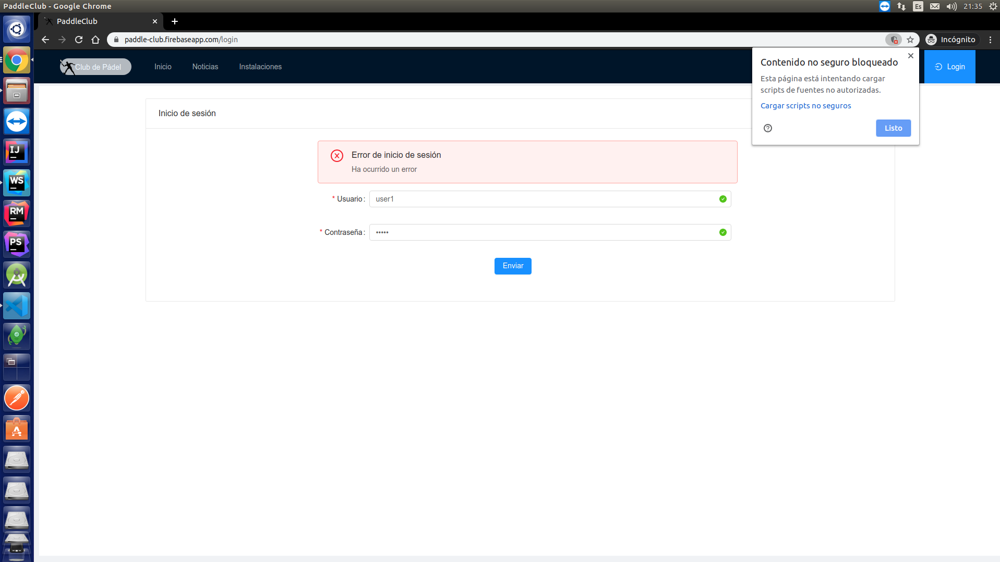
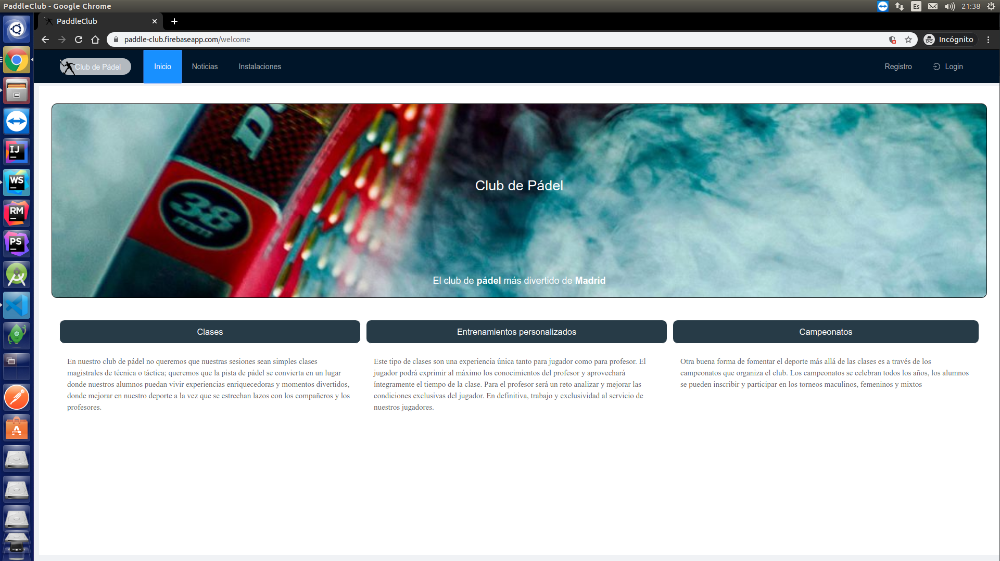
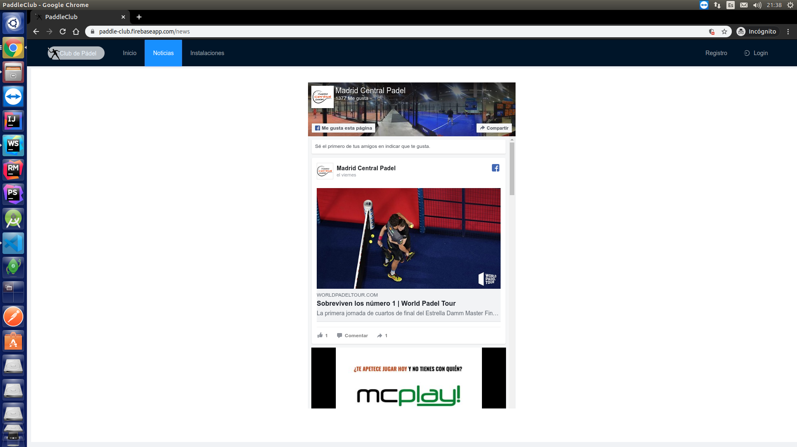
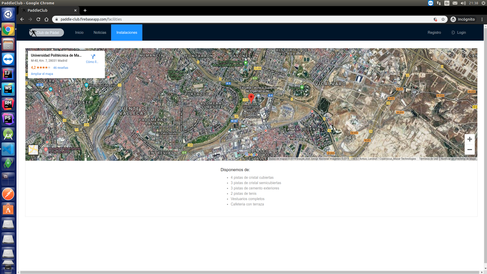
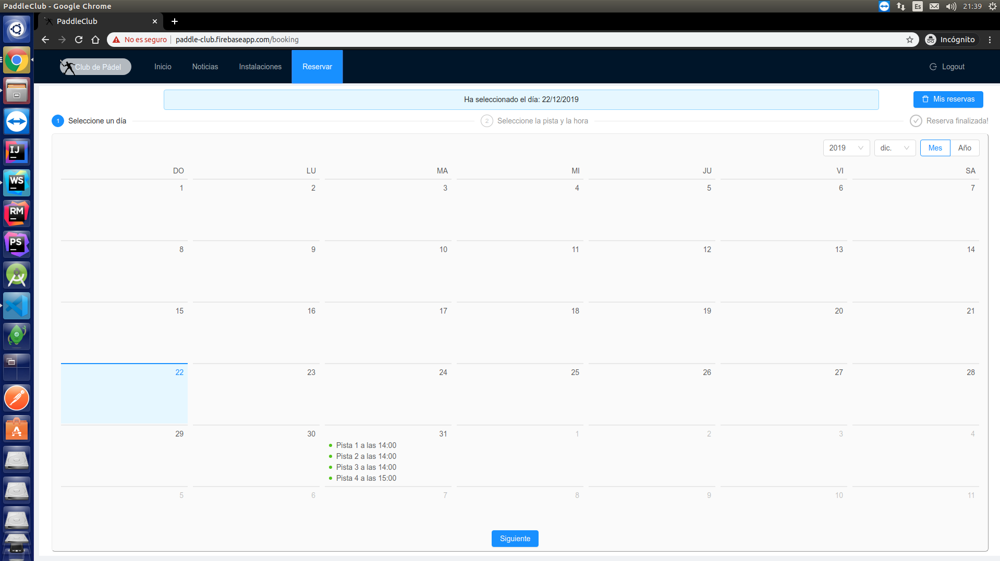
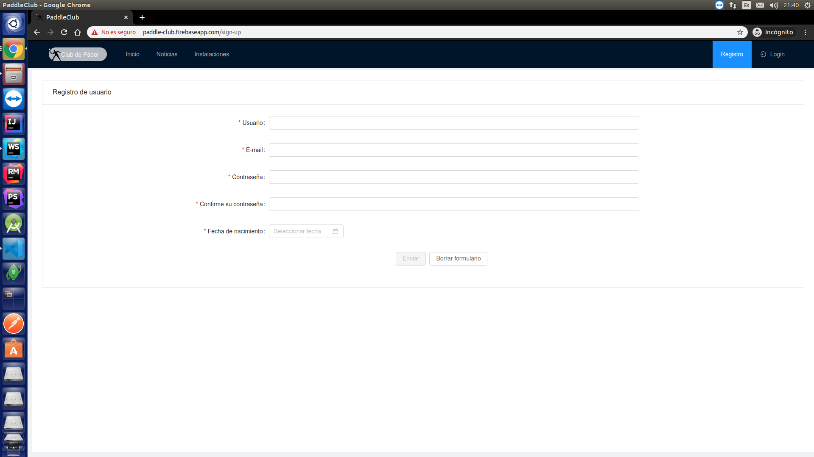
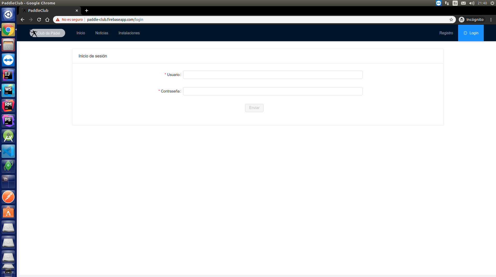

# PaddleClub

This project was generated with [Angular CLI](https://github.com/angular/angular-cli) version 8.3.20.

## Development server

Run `ng serve` for a dev server. Navigate to `http://localhost:4200/`. The app will automatically reload if you change any of the source files.

## Description

This single-page application is created in Angular and has next content:

- Welcome: information about paddle-club
- News: facebook page with news about paddle
- Facilities: location and random info
- Booking: Show list of reservations made by logged user. Let make reservations and remove by reservation
- Sign-up: Form to sign-up in application
- Login: Form to login

## Some curiosities
- If a user is logged can see `booking` page but cannot see `sign-up` page. In other hand login item menu is hidden to show logout item menu.
- If a user is logged and request `sign-up` page, it will be redirect to welcome page, and if other non valid url is request it will be redirecto too.
- If a user is not logged and request `booking` page it will be redirect to `login` page and once he/she login it will be redirect to `booking`
- Reservations are implemented to a user follow 3 simple steps (Select day, select court and select an hour). Make a booking in non-valid day or hour is
 cover by filtered hours and not let select previous days from the current. 
- Remove reservations was not required in rubric but i implemented it and let remove by reservation.

## Deploy
[If you want to see my demo click here](https://paddle-club.firebaseapp.com/booking) but first load insecure scripts, this is needed because back is implemented
in http and firebase hosting use https. If you dont trust it see network request.

## Screenshots

# License

MIT
